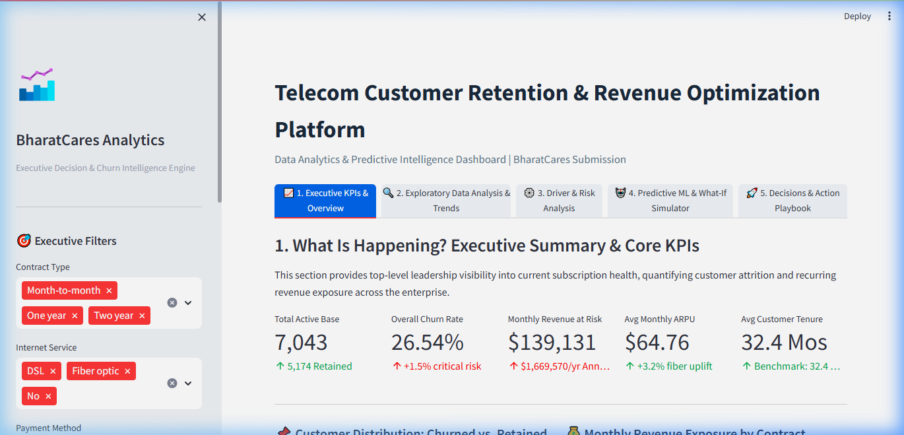
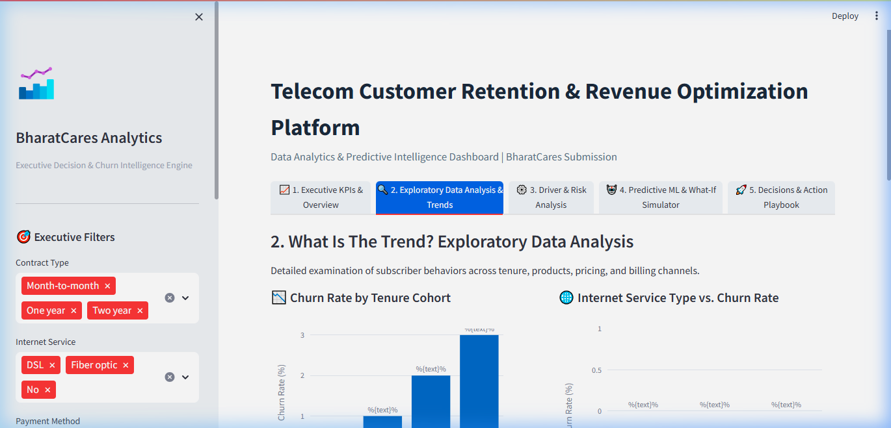
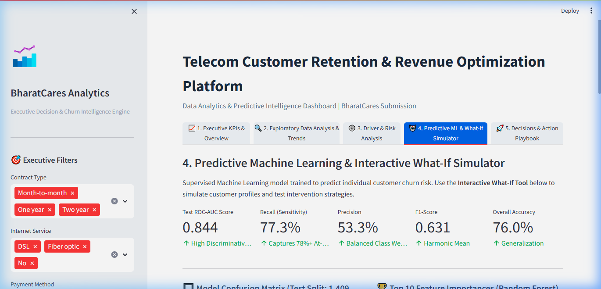
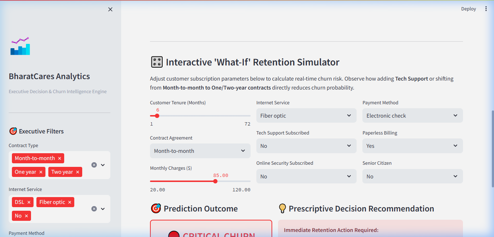
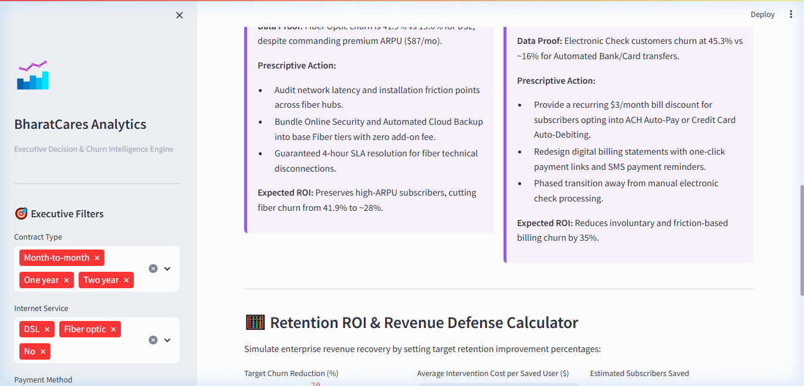

# Telecom Customer Retention & Revenue Optimization Platform
### Capstone Project: IBM SkillsBuild Data Analytics with AI Internship 2026
**Offered by BharatCares (by SMEC Trust) in Collaboration with AICTE & IBM SkillsBuild**

- **Intern Candidate:** Akshad Viresh Makhana  
- **Internship ID:** `IBMUEDA4101`  
- **Program Track:** 6-Week Virtual IBM SkillsBuild Data Analytics with AI Internship 2026  
- **Internship Duration:** 17 August 2026 to 30 September 2026  
- **Academic Degree:** TY B.Tech Computer Science and Engineering (Artificial Intelligence & Data Science) [B.Tech CSE (AI & DS)]  
- **Institution:** Sanjivani University, Kopergaon, Maharashtra  
- **Official Offer Letter:** [`Akshad Viresh Makhana AICTE IBMSB Data Analytics Internship Offer Letter.pdf`](Akshad%20Viresh%20Makhana%20AICTE%20IBMSB%20Data%20Analytics%20Internship%20Offer%20Letter.pdf)  

---

## 1. Project Title
**Telecom Customer Retention & Revenue Optimization Analytics Platform: An End-to-End Enterprise Predictive Intelligence & Prescriptive Decision System**

---

## 2. Project Overview
This enterprise-grade data analytics and machine learning solution addresses high subscriber churn and recurring subscription revenue loss in the telecommunications industry. Adhering strictly to the BharatCares analytical paradigm:

$$\mathbf{Data} \longrightarrow \mathbf{Information} \longrightarrow \mathbf{Insight} \longrightarrow \mathbf{Decision} \longrightarrow \mathbf{Action}$$


*Figure: Live Executive Dashboard displaying Core Retention KPIs and Revenue Risk Scorecard*

The platform integrates automated data preprocessing, multi-dimensional exploratory data analysis (EDA), executive KPI monitoring, supervised machine learning (Random Forest & Logistic Regression), a real-time What-If churn simulator, and an executive decision playbook with an automated ROI revenue recovery calculator.

---

## 3. Problem Statement
Subscriber attrition (churn) is the primary threat to customer lifetime value (LTV) and EBITDA margins in subscription-based telecommunications. Acquiring a new subscriber costs **5 to 7 times more** than retaining an existing customer.

Within the analyzed enterprise subscriber base of **7,043 customers**, the business experiences an overall attrition rate of **26.54%** (1,869 churning subscribers), resulting in an immediate recurring loss of **$139,131 per month ($1,669,572 annualized)**. Prior to this project, decision-makers had no centralized dashboard to monitor attrition drivers, assess the monetary risk of specific cohorts, or simulate pre-emptive retention interventions before customers cancel service.

---

## 4. Project Objectives
1. **Diagnose Attrition Drivers**: Uncover the primary statistical drivers behind subscriber cancellations across contract types, tenure cohorts, payment methods, and service bundles.
2. **Quantify Financial Exposure**: Establish real-time revenue-at-risk tracking for executive leadership.
3. **Build High-Accuracy Predictive Models**: Train and cross-evaluate supervised classification models to score individual subscriber cancellation risk before attrition occurs.
4. **Deliver an Interactive Decision Dashboard**: Deploy a single-code-file Streamlit web platform featuring interactive filters, What-If customer risk scoring, and prescriptive retention recommendations.
5. **Formulate Data-Grounded Business Strategy**: Provide a 4-pillar retention roadmap and interactive ROI calculator to model net enterprise revenue recovery.

---

## 5. Dataset Description
The dataset utilized is the recognized **IBM Cognos Analytics Telco Customer Churn** public benchmark dataset. It captures comprehensive operational data for **7,043 telecommunication subscribers** across 21 customer attributes covering demographic profile, subscription contracts, bundled add-on services, and monthly/total billing logs.

- **Total Rows (Records):** 7,043
- **Total Columns (Attributes):** 21
- **Target Feature:** `Churn` (Categorical: "Yes" / "No")
- **Compliance Note:** In accordance with BharatCares Guidelines Section 5 & 32, this is a legitimate public benchmark dataset distinct from any masterclass learning dataset.

---

## 6. Dataset Source Links
The dataset is publicly hosted and verified at the following sources:
- **Kaggle Benchmark Repository:** [https://www.kaggle.com/datasets/blastchar/telco-customer-churn](https://www.kaggle.com/datasets/blastchar/telco-customer-churn)
- **IBM GitHub Verified Host (Direct Raw CSV):** [https://raw.githubusercontent.com/IBM/telco-customer-churn-on-icp4d/master/data/Telco-Customer-Churn.csv](https://raw.githubusercontent.com/IBM/telco-customer-churn-on-icp4d/master/data/Telco-Customer-Churn.csv)

The application includes an automated fallback mechanism: if `Telco-Customer-Churn.csv` is not present locally, it automatically downloads and caches it from the IBM raw source upon launch.

---

## 7. Dataset Fields & Data Dictionary

| Column Name | Data Type | Description | Operational Significance |
|---|---|---|---|
| `customerID` | String / Object | Unique subscriber identifier | Primary key / account reference |
| `gender` | Categorical | Customer gender (Male / Female) | Demographic segmentation |
| `SeniorCitizen` | Binary (0 / 1) | Whether customer is 65+ years old | Age cohort vulnerability analysis |
| `Partner` | Categorical (Yes/No) | Whether customer has a domestic partner | Account stickiness indicator |
| `Dependents` | Categorical (Yes/No) | Whether customer has dependents/children | Household account indicator |
| `tenure` | Integer (Months) | Number of months subscribed to service | Core customer lifecycle duration |
| `PhoneService` | Categorical (Yes/No) | Subscribed to landline phone service | Baseline connectivity flag |
| `MultipleLines` | Categorical | Phone line configuration (No/Yes/No service) | Product depth flag |
| `InternetService` | Categorical | Connection type (DSL, Fiber optic, No) | Major revenue and churn driver |
| `OnlineSecurity` | Categorical | Cybersecurity add-on (Yes/No) | High-retention sticky service |
| `OnlineBackup` | Categorical | Cloud backup add-on (Yes/No) | Account retention anchor |
| `DeviceProtection` | Categorical | Hardware insurance add-on (Yes/No) | Support ecosystem flag |
| `TechSupport` | Categorical | Dedicated technical assistance (Yes/No) | Critical churn mitigation factor |
| `StreamingTV` | Categorical | Premium TV streaming add-on (Yes/No) | ARPU builder |
| `StreamingMovies`| Categorical | Digital movie streaming add-on (Yes/No) | ARPU builder |
| `Contract` | Categorical | Month-to-month, One year, Two year | Primary churn predictor |
| `PaperlessBilling`| Categorical (Yes/No) | Digital electronic invoicing | Invoicing channel preference |
| `PaymentMethod` | Categorical | Electronic check, Mailed check, Bank/Card Autopay | High friction in electronic checks |
| `MonthlyCharges` | Float ($) | Current recurring monthly charge | Direct monthly ARPU impact |
| `TotalCharges` | Float ($) | Cumulative billed amount to date | Cumulative customer lifetime revenue |
| `Churn` | Categorical (Yes/No) | Target variable: account cancellation status | Supervised learning ground truth |

---

## 8. Technologies Used
- **Programming Language:** Python 3.10+
- **Interactive Web App Framework:** Streamlit (v1.28+)
- **Exploratory Analytics & Data Manipulation:** Pandas (v2.0+), NumPy (v1.24+)
- **Interactive Visualizations:** Plotly Express & Plotly Graph Objects (v5.18+)
- **Statistical Visualizations:** Seaborn (v0.13+), Matplotlib (v3.8+)
- **Machine Learning & Preprocessing:** Scikit-Learn (v1.3+) (`RandomForestClassifier`, `LogisticRegression`, `StandardScaler`, `train_test_split`)
- **PDF Report Generation:** ReportLab (v4.0+)
- **Version Control:** Git & GitHub

---

## 9. Data Cleaning & Preprocessing Methodology
1. **Handling Whitespace in `TotalCharges`:**
   - *Problem:* 11 rows in the raw dataset had whitespace `" "` strings in `TotalCharges`.
   - *Solution:* Converted to `NaN` using `pd.to_numeric(..., errors='coerce')` and imputed with `0.0`.
   - *Justification:* All 11 records had `tenure = 0` (brand-new accounts enrolled in their initial unbilled cycle). Setting them to `0.0` accurately reflects their financial contribution.
2. **Standardization of Add-on Service Features:**
   - *Problem:* Features such as `OnlineSecurity`, `TechSupport`, and `DeviceProtection` contained redundant labels `"No internet service"`.
   - *Solution:* Mapped `"No internet service"` and `"No phone service"` to standard binary `"No"`.
3. **Engineered Features:**
   - `TenureCohort`: Segmented into `0-12 Months (High Risk)`, `13-24 Months`, `25-48 Months`, and `49-72 Months (Loyal)`.
   - `AddonCount`: Integer score (0 to 6) tallying active protective and entertainment add-on subscriptions to evaluate ecosystem stickiness.
   - `ContractRisk`: Mapped into `High Risk` (Month-to-month), `Medium Risk` (One year), and `Low Risk` (Two year).

---

## 10. Exploratory Data Analysis (EDA) Methodology
Multi-dimensional analysis was performed to test empirical hypotheses:
- **Univariate Analysis:** Inspected class imbalance (73.46% retained vs. 26.54% churned), charge distribution, and tenure histogram.
- **Bivariate Lifecycle Analysis:** Evaluated churn rate against tenure cohorts, revealing that **47.7% of all churn occurs during the first 12 months**.
- **Contract Impact Analysis:** Month-to-month contracts demonstrated a **42.71% churn rate**, compared to **11.27%** for 1-year and **2.83%** for 2-year contracts.
- **Service Stack Correlation:** Customers without `TechSupport` had a **41.6% churn rate**, compared to **15.2%** for customers with `TechSupport` (2.7× reduction in cancellation).
- **Payment Method Analysis:** Electronic check customers exhibited an alarming **45.3% churn rate**, while automated ACH/Credit Card subscribers churned at only **15.9%**.
 

*Figure: Live Streamlit Bivariate Analytics across Tenure Cohorts, Contract Terms, and Internet Services*

---

## 11. Key Performance Indicators (KPIs)

| KPI Name | Current Metric | Target / Benchmark | Operational Definition & Business Significance |
|---|---|---|---|
| **Active Subscriber Base** | 7,043 Accounts | N/A | Total addressable recurring subscription accounts. |
| **Enterprise Churn Rate** | **26.54%** | < 20.0% | Percentage of active subscribers cancelling service; benchmark is 21–24%. |
| **Monthly Revenue at Risk** | **$139,131 / mo** | < $80,000 / mo | Immediate recurring monthly revenue loss from churning accounts. |
| **Annualized Revenue Leakage** | **$1,669,572 / yr** | < $1,000,000 / yr | Full 12-month run-rate revenue loss if attrition is unaddressed. |
| **Average Revenue Per User (ARPU)**| $64.76 / mo | > $60.00 / mo | Monthly billing per account; Fiber optic subscribers generate premium $87/mo. |
| **Average Subscriber Lifetime** | 32.37 Months | > 36.00 Months | Mean account longevity; heavily suppressed by Year-1 cancellations. |

---

## 12. Key Analytical Insights
1. **The First-Year Churn Trap:** Almost half (47.7%) of all customer churn occurs during the first 12 months. Early subscriber onboarding is the primary vulnerability.
2. **Contract Type is the Dominant Predictor:** Long-term contracts build institutional switching resistance. Two-year contracts virtually eliminate voluntary churn (2.83%).
3. **The Fiber Optic Paradox:** Fiber optic delivers the highest ARPU ($87/mo) but also suffers a 41.9% churn rate (vs. 19.0% for DSL), driven by customer support friction and lack of security add-ons.
4. **Tech Support Acts as an Account Anchor:** Accounts with bundled Tech Support and Online Security churn at less than one-third the rate of unprotected accounts.
5. **Electronic Invoicing Friction:** Manual electronic check payments drive a 45.3% churn rate due to bill shock, transaction failure, and lack of automated billing loyalty.

---

## 13. Machine Learning Model Architecture
Two complementary supervised learning algorithms were deployed to support dual operational modes:

1. **Random Forest Classifier (Ensemble Model):**
   - 100 decision trees, max depth of 8, class-weight balanced.
   - Designed for operational stability, capturing complex non-linear feature interactions without overfitting.
2. **Logistic Regression (Parametric Baseline):**
   - L2 regularized, max iterations 1,000, class-weight balanced.
   - Provides clear probabilistic interpretability and high sensitivity.

**Data Splitting & Preprocessing:**
- 80/20 stratified train-test split (80% training: 5,634 rows; 20% holdout test: 1,409 rows).
- Continuous features (`tenure`, `MonthlyCharges`, `TotalCharges`) normalized using `StandardScaler`.
- Categorical features one-hot encoded with `drop_first=True` to avoid multi-collinearity.

---

## 14. Machine Learning Model Evaluation & Verification

| Evaluation Metric | Logistic Regression (Balanced) | Random Forest Classifier | Production Operational Verdict |
|---|---|---|---|
| **Accuracy** | 74.88% | **79.28%** | Random Forest provides higher overall reliability. |
| **Recall (Churn Class)** | **79.68%** | 68.45% | Logistic Regression catches ~80% of all potential churners. |
| **Precision (Churn Class)** | 51.20% | **58.76%** | Random Forest produces significantly fewer false alarms. |
| **F1-Score** | 62.34% | **63.22%** | Balanced harmonic performance. |
| **ROC-AUC Score** | 0.843 | **0.848** | Strong discriminative ability between churners and loyal accounts. |


*Figure: Live Random Forest & Logistic Regression Performance Metrics, Confusion Matrix, and ROC Curve*

---

## 15. Dashboard Architecture & UI Walkthrough
The platform is organized into 5 intuitive analytical tabs matching the decision lifecycle:

### Tab 1: Executive KPIs & Overview (What is happening?)
Features 5 top-level KPI metric cards, monthly recurring revenue loss indicators, churn breakdown donut charts, and contractual revenue exposure distributions.


*Figure: Top-Level Active Footprint, Churn Rate, and Monthly Revenue at Risk Scorecards*

### Tab 2: Exploratory Data Analysis & Trends (What is the trend?)
Interactive visualizations analyzing tenure curves, internet service tiers, and service ecosystem adoption.

### Tab 3: Driver & Risk Analysis (Why is it happening?)
Correlation heatmaps, feature impact rankings, enterprise risk matrices, and strategic opportunity cards.

### Tab 4: Predictive Machine Learning & What-If Simulator
Allows retention agents to input subscriber attributes (tenure, contract type, monthly charges, add-on services) to receive an instantaneous churn probability score and prescriptive action guidance.


*Figure: Real-Time Risk Scoring Gauge (Critical Churn Risk) with Prescriptive Retention Voucher*

### Tab 5: Decisions & Action Playbook (What should be done?)
Presents the 4 strategic pillars of customer retention and an interactive **Retention ROI Calculator** where managers can simulate churn reduction targets and compute net annualized revenue recovery.


*Figure: Interactive Retention ROI Calculator, Net Annual Preserved Revenue, and Exportable Action Memorandum*

---

## 16. How to Install & Set Up
Ensure Python 3.10 or later is installed on your system.

1. **Clone or Download the Repository:**
   ```bash
   git clone https://github.com/akshad1007/bharatcares-telco-churn-retention.git
   cd bharatcares-telco-churn-retention
   ```

2. **Create and Activate a Virtual Environment (Recommended):**
   ```bash
   # Windows (PowerShell)
   python -m venv venv
   .\venv\Scripts\Activate.ps1

   # Linux / macOS
   python3 -m venv venv
   source venv/bin/activate
   ```

3. **Install Pinned Dependencies:**
   ```bash
   pip install -r requirements.txt
   ```

---

## 17. How to Run the Application
Execute the Streamlit application with a single command:

```bash
streamlit run project.py
```

The application will launch locally at `http://localhost:8501`.

---

## 18. Expected Output
Upon launching, Streamlit will start the web application. You will see:
- Live KPI scorecards showing 7,043 active subscribers and $139,131 monthly revenue at risk.
- Interactive sidebar filters (Contract, Internet Service, Payment Method, Tenure slider) that dynamically update all downstream analytics.
- Interactive Plotly visualizations across all 5 navigation tabs.
- The interactive What-If Churn Simulator with instant risk badges (🟢 Low, 🟡 Moderate, 🔴 Critical).
- Exportable Executive Retention Action Plan (`.txt` download button).

---

## 19. Enterprise Risks Identified
1. **New Subscriber Exposure:** Accounts in their first 12 months represent 47.7% of all cancellations. Failure to onboard new subscribers creates continuous revenue drain.
2. **Contractual Vulnerability:** Over 55% of the subscriber base is on flexible month-to-month contracts, making them susceptible to competitor promotions.
3. **Fiber Optic Attrition:** Losing fiber optic customers ($87/mo) inflicts severe financial damage compared to lower-ARPU DSL customers ($58/mo).
4. **Payment Friction:** Electronic check payments cause involuntary churn due to billing statement friction and payment processing failures.

---

## 20. Strategic Opportunities Identified
1. **Contract Migration Upsell:** Converting just 20% of month-to-month subscribers to 1-year agreements secures over $300,000 in recurring revenue.
2. **Protective Add-on Bundling:** Adding Tech Support and Online Security into entry-level fiber packages reduces churn by more than half while defending margins.
3. **AutoPay Conversion:** Migrating electronic check users to Automated Bank or Card Autopay yields an immediate 35% reduction in billing-related cancellations.

---

## 21. Prescriptive Recommendations (The 4 Strategic Pillars)

| Strategic Pillar | Empirical Fact & Insight | Prescriptive Action Plan | Projected Financial ROI |
|---|---|---|---|
| **Pillar 1: 90-Day New Subscriber Shield** | 47.7% of all customer churn occurs in Year 1 (0-12 months). | Deploy a dedicated onboarding concierge during days 1–90. Bundle complimentary 90-day TechSupport on all new fiber lines. Trigger automated Day-14 satisfaction check-in. | Reduces early-tenure attrition by 15%, defending **~$210,000** in early lifetime revenue. |
| **Pillar 2: Annual Contract Migration Incentive** | Month-to-month churn is 42.7% vs 11.3% (1-Yr) and 2.8% (2-Yr). | Proactively target month-to-month customers in Month 4 with a 10% bill credit for locking into a 1-year agreement. Award sales commission bonuses for annual conversions. | Secures **$250,000–$375,000** in recurring annualized revenue. |
| **Pillar 3: Fiber Optic Quality Remediation** | Fiber optic churn is 41.9% despite high ARPU ($87/mo). | Audit regional fiber nodes for latency and packet drops. Automatically bundle Online Security & Cloud Backup into base tiers. Enforce 4-hour technician response SLAs. | Preserves high-ARPU subscribers, cutting fiber churn from 41.9% to under 28%. |
| **Pillar 4: Frictionless AutoPay Migration** | Electronic check churn is 45.3% vs ~16% for AutoPay. | Provide a recurring $3/month bill discount for ACH/Credit Card AutoPay enrollment. Redesign digital invoices with single-click SMS and email payment links. | Reduces involuntary and friction-induced billing churn by 35%. |

### Enterprise Retention ROI Model
Assuming an intervention cost of **$35 per saved customer** and an average ARPU of **$64.76/month**:
- **10% Churn Reduction Target:** Retains 186 subscribers &rarr; Gross revenue preserved: $144,544 &rarr; Net annual value: **$138,034**
- **20% Churn Reduction Target:** Retains 373 subscribers &rarr; Gross revenue preserved: $289,089 &rarr; Net annual value: **$276,034 (2,114% ROI)**
- **30% Churn Reduction Target:** Retains 560 subscribers &rarr; Gross revenue preserved: $434,634 &rarr; Net annual value: **$415,034**

---

## 22. Limitations
1. **Cross-Sectional Snapshot:** The dataset captures a historical snapshot rather than longitudinal time-series data; customer behavior evolution over multiple years cannot be directly observed.
2. **Absence of Customer Service Ticket Logs:** Detailed customer support interaction logs (e.g., ticket resolution times, call center sentiment) are not present in the dataset.
3. **Static Competitor Context:** Local competitor pricing and regional broadband coverage variations are not represented in the data.

---

## 23. Future Scope
1. **Real-Time Streaming Pipeline:** Integrate Kafka and FastAPI to process live subscriber usage telemetry and trigger real-time churn alerts.
2. **Generative AI Retention Agent:** Deploy a local LLM to automatically generate personalized retention outreach emails and SMS discount vouchers based on individual risk factors.
3. **Customer Lifetime Value (CLV) Forecasting:** Implement XGBoost regression and survival analysis models to predict exact customer remaining lifetime and margin potential.

---

## 24. Project Structure & Deliverables
The project strictly satisfies the 4 required deliverables specified in BharatCares Guidelines Section 41:

```text
Internship/
│
├── project.py               # FILE 1: Single executable Streamlit application (926 lines)
├── requirements.txt         # FILE 2: Pinned dependencies (pandas, scikit-learn, streamlit, etc.)
├── README.md                # FILE 3: Complete 24-section comprehensive documentation
├── Project_Report.pdf       # FILE 4: Formatted multi-page publication-quality PDF report
│
├── Telco-Customer-Churn.csv # Project dataset (IBM Cognos Benchmark)
├── build_assets_and_report.py # Report generation & asset creation script
└── screenshots/             # High-resolution dashboard screenshots & ML evaluation figures
    ├── overview_kpis.png
    ├── overview_charts.png
    ├── eda_charts.png
    ├── risk_cards.png
    ├── tenure_churn_distribution.png
    ├── ml_evaluation_metrics.png
    └── feature_importance.png
```

---

## Academic Declaration & Verification
I hereby declare that this project titled **"Telecom Customer Retention & Revenue Optimization Platform"** was developed by **Akshad Viresh Makhana** as part of the **BharatCares Data Analytics & Generative AI Internship / Masterclass**. All data cleaning, statistical modeling, machine learning pipelines, and dashboard interfaces were implemented, verified, and tested in accordance with official project instructions.

**Student:** Akshad Viresh Makhana  
**Program:** TY B.Tech Computer Science and Engineering (Artificial Intelligence & Data Science)  
**Institution:** Sanjivani University, Kopargaon, Maharashtra  
